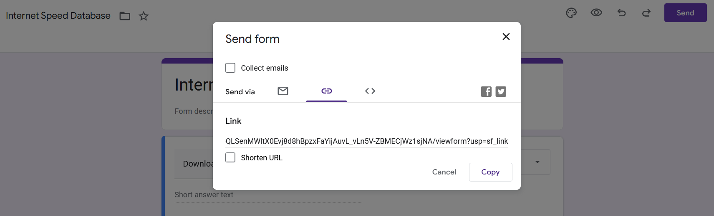

<!-- anchor tag for back-to-top links -->
<a name="readme-top"></a>

<!-- PROJECT LOGO -->
<p align=center></p>

<!-- SHORT SUMMARY  -->
Do you get what you pay for when it comes to your internet speed? If not, maybe it's time to take action.


---

## Table of Contents
<ol>
    <li>
      <a href="#about-the-project">About The Project</a>
      <ul>
        <li><a href="#built-with">Built With</a></li>
      </ul>
    </li>
    <li>
      <a href="#usage">Usage</a>
    </li>
    <ul>
        <li><a href="#speedtest-and-data-entry">Speedtest and Data Entry</a></li>
        <li><a href="#data-analysis">Data Analysis</a></li>
        <li><a href="#tweet-customer-complaint">Tweet Customer Complaint</a></li>
    </ul>
    <li>
      <a href="#getting-started">Getting Started</a>
      <ul>
        <li><a href="#prerequisites">Prerequisites</a></li>
        <li><a href="#installation">Installation</a></li>
      </ul>
    </li>
</ol>

<!-- ABOUT THE PROJECT -->
## About The Project
The Internet Speed Database project helps you to find out if you really get the internet speed that you pay for. If you don't, it also helps you to do something about it. 
It accomplishes this by doing the following:
+ **Data collection**: Perform automated internet speedtests and collect data on your download speed, upload speed, and internet provider 
+ **Data entry**: Perform automated data entry by submitting the collected data to a Google Form 
+ **Data storage**: Create an internet speed database in the form of a simple Google Sheet and store it in your Google Drive
+ **Data analysis**: Analyze your average download speed and upload speed across multiple speedtests and compare it with the internet speed promised by your internet provider
+ **Customer complaint**: If your internet speed is consistently lower than promised by your provider, file an automated customer complaint on Twitter

### Built With
* [![Selenium][Selenium-badge]][Selenium-url]
* [![Pandas][Pandas-badge]][Pandas-url]
* [![PyCharm][PyCharm-badge]][PyCharm-url]

<p align="right">(<a href="#readme-top">back to top</a>)</p>

<!-- USAGE -->
## Usage
### Speedtest and Data Entry
Run `main.py` to perform an automated speedtest plus data entry.


### Data Analysis
Run `data_analysis.py` to get your average download speed and upload speed by internet provider.
<a href="https://github.com/JensBender/internet-speed-database"></a>

### Tweet Customer Complaint
Run `twitter.py` to tweet a complaint. Specify the internet provider like this: `twitter_bot.tweet_complaint(internet_provider="True Internet")`.

<a href="https://github.com/JensBender/internet-speed-database"></a>

<p align="right">(<a href="#readme-top">back to top</a>)</p>

<!-- GETTING STARTED -->
## Getting Started

Follow these steps to get the program running on your local machine.

### Prerequisites

This is a list of things you need to use this program.
<ul>
  <li>Python packages</li>
  <ul>
    <li>Selenium</li>
    <li>Pandas</li>
    <li>Requests</li>
  </ul>
  <li>Google account</li>
  <ul>
    <li>Google Forms</li>
    <li>Google Sheets</li>
  </ul>
  <li>Sheety API</li>
  <li>Twitter account</li>
</ul>

### Installation

1. Install the following packages: Selenium, Pandas, and Requests.
2. Go to <a href="https://www.selenium.dev/documentation/webdriver/getting_started/install_drivers/">selenium.dev</a> and download the WebDriver for Chrome.
3. Install Chrome WebDriver and paste the path in `your_secrets.py`.
     ```
     CHROME_DRIVER_PATH = "YOUR_PATH_HERE"
     ```
4. Create a Google Form named "Internet Speed Database".
5. Create three questions for (1) Download speed, (2) Upload speed, and (3) Internet provider in precisely this order. <br /> 
For all questions, select "Short answer" as the response format. <br />
<a href="https://github.com/JensBender/internet-speed-database"></a>
6. Copy the url of your Google Form. <br />
<a href="https://github.com/JensBender/internet-speed-database"></a>
7. Paste it in `your_secrets.py`.
     ```
     GOOGLE_FORM_URL = "URL_TO_YOUR_GOOGLE_FORM"
     ```
8. Go to your Google Form "Responses" and click on "Create Spreadsheet". <br />
<a href="https://github.com/JensBender/internet-speed-database"></a>
9. Create a new spreadsheet named "Internet Speed Database". <br />
<a href="https://github.com/JensBender/internet-speed-database"></a>
10. This is how your Google Sheet should look like. <br />
<a href="https://github.com/JensBender/internet-speed-database"></a>
11. To get the data from the Google Sheet, use Sheety API. Go to <a href="https://sheety.co/">sheety.co</a> and click "Connect Google Sheet". Sign in with your Google account. <br />
12. Click on "New Project" → "From Google Sheet". Next, insert the url of your Google Sheet. <br />
<a href="https://github.com/JensBender/internet-speed-database"></a>
13. Copy the API endpoint of your Sheety project. <br />
<a href="https://github.com/JensBender/internet-speed-database"></a>
14. Paste it in `your_secrets.py`.
     ```
     SHEETY_PROJECT_ENDPOINT = "URL_TO_YOUR_SHEETY_PROJECT"
     ```
15. Go to your Sheety project "Authentication" and create a Bearer Token. Save the changes.
<a href="https://github.com/JensBender/internet-speed-database"></a>
16. Copy & paste your Bearer Token in `your_secrets.py`.
    ```
    SHEETY_BEARER_TOKEN = "YOUR_BEARER_TOKEN"
    ```
17. Enter your Twitter login information in `your_secrets.py`.
    ```
    TWITTER_EMAIL = "YOUR_TWITTER_EMAIL"
    TWITTER_USERNAME = "YOUR_TWITTER_USERNAME"
    TWITTER_PASSWORD = "YOUR_TWITTER_PASSWORD"
    ```
18. Enter your internet provider's promised download and upload speed in `your_secrets.py`.
    ```
    PROMISED_DOWNLOAD = 10  # substitute the download speed promised by your internet provider
    PROMISED_UPLOAD = 10  # substitute the upload speed promised by your internet provider
    ```

<p align="right">(<a href="#readme-top">back to top</a>)</p>

<!-- MARKDOWN LINKS -->
[Pandas-badge]: https://img.shields.io/badge/pandas-%23150458.svg?style=for-the-badge&logo=pandas&logoColor=white
[Pandas-url]: https://pandas.pydata.org/
[PyCharm-badge]: https://img.shields.io/badge/pycharm-143?style=for-the-badge&logo=pycharm&logoColor=black&color=black&labelColor=green
[PyCharm-url]: https://www.jetbrains.com/pycharm/
[Selenium-badge]: https://img.shields.io/badge/-selenium-%43B02A?style=for-the-badge&logo=selenium&logoColor=white
[Selenium-url]: https://www.selenium.dev/
